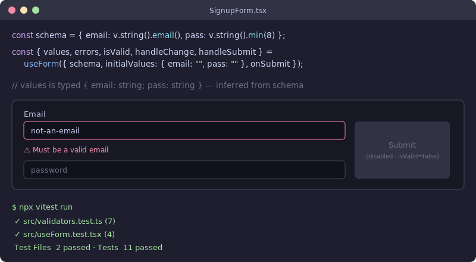

# use-form-ts

[](https://github.com/JCreatesGH/use-form-ts/actions)
[](https://www.typescriptlang.org/)
[](LICENSE)

A tiny, **type-safe** form state + validation hook for React. Define a schema, get fully-inferred `values` and `errors`, no `any`. Zero runtime dependencies — a lightweight alternative to heavier form libraries when you just need validation done right.



## Install

```bash
npm install use-form-ts
```

## Usage

```tsx
import { useForm, v } from "use-form-ts";

const schema = {
  email: v.string().email(),
  password: v.string().min(8, "At least 8 characters"),
  age: v.number().min(18).optional(),
};

function SignupForm() {
  const { getFieldProps, errors, touched, isValid, isDirty, handleSubmit } =
    useForm({
      schema,
      initialValues: { email: "", password: "", age: undefined },
      onSubmit: (values) => api.signup(values), // `values` is fully typed
    });

  return (
    <form onSubmit={handleSubmit}>
      {/* getFieldProps spreads name + value + onChange + onBlur */}
      <input {...getFieldProps("email")} />
      {touched.email && errors.email && <span>{errors.email}</span>}
      <button disabled={!isValid || !isDirty}>Sign up</button>
    </form>
  );
}
```

`values`, `errors`, `setFieldValue`, and `getFieldProps` are all inferred from `schema` — rename
a field and TypeScript flags every stale usage, and passing the wrong value type
(`setFieldValue("age", "x")`) is a compile error.

## Why

- **Real inference** — the schema drives the types of `values`, `errors`, and every setter; no `any` leaks through the hook.
- **Composable validators** — `v.string().min(3).max(20).pattern(/^[a-z]+$/)`, `v.number().refine(fn, msg)`, `v.oneOf(["a","b"])`, `.optional()`.
- **Batteries-included hook** — `getFieldProps`, `handleChange` / `handleBlur` / `handleSubmit`, `touched`, `isValid`, `isDirty`, `submitting`, `reset(next?)`, `setFieldValue`, `setFieldTouched`.
- **Real-input aware** — `handleChange` coerces `type="number"`/`"range"` to numbers and checkboxes to booleans, so `v.number()` schemas validate against actual DOM inputs.
- **Tiny** — no dependencies beyond React; ~2KB.

## API

### Validators

| Validator | Modifiers |
|-----------|-----------|
| `v.string()` | `.min` `.max` `.email` `.pattern` `.refine` `.optional` |
| `v.number()` | `.min` `.max` `.refine` `.optional` |
| `v.boolean()` | `.refine` `.optional` |
| `v.oneOf([...])` | `.refine` `.optional` |

`validate(schema, values)` is also exported for validation outside React.

### Hook return value

| Key | Type | Notes |
|-----|------|-------|
| `values` | `Values<S>` | inferred from schema |
| `errors` | `Errors<S>` | per-field messages, recomputed on change |
| `touched` | `Partial<Record<keyof S, boolean>>` | set on blur / submit |
| `isValid` / `isDirty` | `boolean` | valid against schema / changed from baseline |
| `submitting` | `boolean` | true while `onSubmit` is awaiting |
| `getFieldProps(name)` | `{ name, value, onChange, onBlur }` | spread onto an input |
| `setFieldValue(name, value)` | — | type-checked against the field |
| `setFieldTouched(name, b?)` | — | mark a field touched / untouched |
| `reset(next?)` | — | restore baseline, or adopt `next` as the new clean baseline |

## Development

```bash
npm install
npm test    # 17 tests (vitest + @testing-library/react)
npm run build
```

## License

MIT
